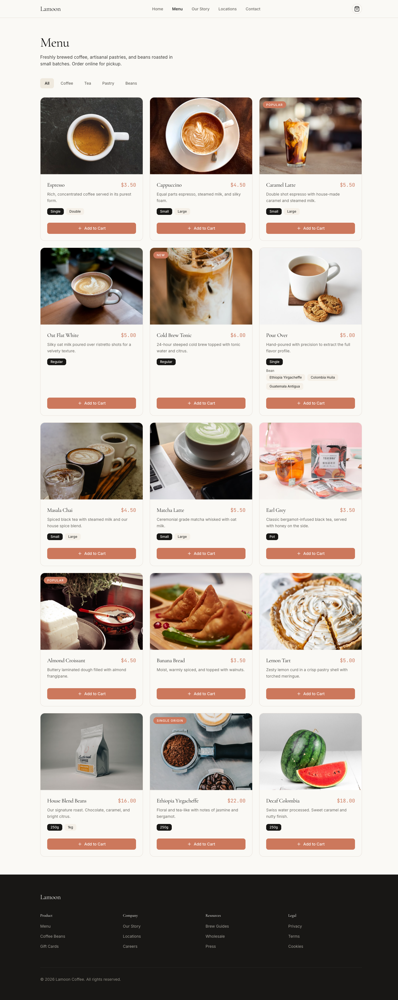

# Lamoon Coffee Shop

A multi-page React SPA for a specialty coffee shop with online ordering. Built with **Bun**, **React 19**, **Tailwind CSS v3**, and **React Router**.


## Features

- **Home Page** — Hero section, featured drinks, story preview, testimonials, and visit CTA
- **Menu Page** — 15 products with category filtering (Coffee, Tea, Pastry, Beans), size/options selection
- **Cart Page** — Full cart management with quantity editing, remove items, checkout form, and order confirmation
- **About Page** — Coffee shop story and values
- **Locations Page** — Café location finder
- **Contact Page** — Contact form with validation
- **Responsive Design** — Mobile-first with hamburger menu and touch-friendly UI
- **Online Ordering** — Add items to cart, select sizes/options, checkout with form validation
- **Cart Persistence** — Cart saved to `localStorage` and survives page refreshes

## Tech Stack

| Layer | Technology |
|---|---|
| Runtime | Bun |
| Framework | React 19 |
| Router | React Router DOM |
| Language | TypeScript |
| Styling | Tailwind CSS v3 |
| UI Primitives | shadcn/ui pattern (Radix + CVA) |
| Icons | Lucide React |
| State | React Context + useReducer |

## Design System

Warm editorial palette inspired by specialty coffee aesthetics:

- **Canvas** `#faf9f5` — page background
- **Primary** `#cc785c` — coral CTA buttons
- **Surface Dark** `#181715` — dark sections, footer
- **Typography** — Cormorant Garamond (serif headlines) + Inter (sans body)



## Getting Started

### Prerequisites

- [Bun](https://bun.sh) installed

### Installation

```bash
bun install
```

### Development

```bash
bun dev
```

This starts the Tailwind CSS watcher and Bun dev server with hot reload.

### Production Build

```bash
bun run build
```

This compiles CSS and bundles the static site to `dist/`.

### Serve Production Build

```bash
bun start
```

## Project Structure

```
src/
├── core/           # Global styles, Tailwind theme
├── shared/         # UI components, layout, hooks, types
├── features/       # Domain features (home, menu, cart, about, locations, contact)
├── pages/          # Thin route wrappers
├── App.tsx         # Router config
└── frontend.tsx    # Entry point
```

## Mobile View


## License

MIT
